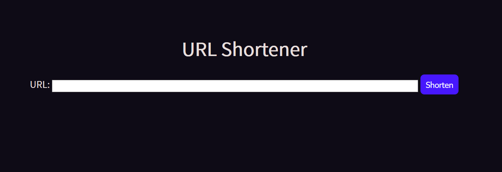

# URL Shortener Application

Simple Application for URL shorting with an API and websites



---

## Features

- Backend for an URL shortener
- Simple frontend

## SETUP

1. Install go: https://golang.org/dl/
2. Install the redis database: https://redis.io/download
3. Install this project using the following command: `go get github.com/PumPum7/URLShorter`
or by copying the source code
4. Create a config.yml file with the following configuration:

```
server:
    host: <the host ip adress as example: localhost>
    port: <the port to use>
database: 
    domain: <the ip and port of the redis database>
    user: "<the user of the database>"
    password: "<the redis password>"
    database: <number of the database to use>
log:
    logfile: "<the path leading to the log file>"
    loglevel: "<the log level to use as example: INFO>"
````
## TODO:
 	- [ ] Improve the test coverage
    - [ ] maybe add more informations and authorization